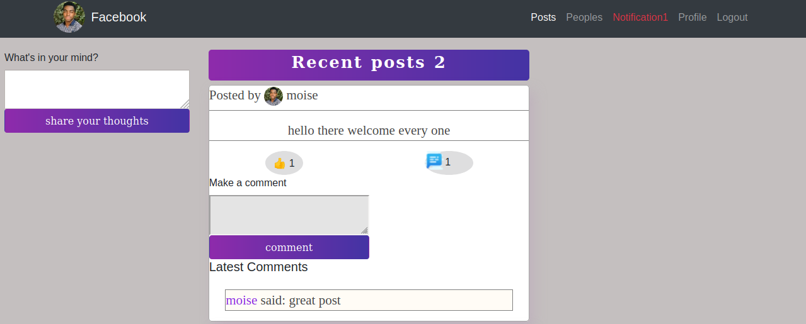

# Facebook Clone

> This repo contains a facebook-like appliction built mainly with ruby in rails.



The application provide the ability to add a post,comment a post,like a post,send and receive friend requests

## Built With

- ruby on rails,
- ruby,
- boostrap,
- postgres

## Live Demo

[Facebook Clone Live Demo](https://sleepy-badlands-59290.herokuapp.com)


## Getting Started


To get a local copy up and running follow these simple example steps.

### Prerequisites
  1. You should make sure you have ruby and rails installed on your local computer
  2. For facebook login, change the API key and secret in ``` config/intializers.devise.rb ``` if you plan on using your own instance of facebook login
### Setup
  1. Clone the repo ``` git clone https://github.com/Tresor11/Facebook-clone.git  ```
2. Install dependencies ``` bundle install ```

### Install
1. Create the database by typing ``` rails db:create ```
2. Run the migration ``` rails db:migrate ```

### Usage
open your local server by typing
`rails s
`
then login in the app and explore the features

### Testing
To run the rest type
`rspec
`
in your terminal


## Authors

👤 **Tresor Bireke**

- Github: [@Tresor11](https://github.com/Tresor11)
- Twitter: [@TBireke](https://twitter.com/TBireke)
- Linkedin: [Tresor Bireke Muhigirwa](https://www.linkedin.com/in/tr%C3%A9sor-bireke-3b7443188/
)

👤 **Sharmarke Ahmed**

- Github: [@mrnadaara](https://github.com/mrnadaara)
- Twitter: [@mrnadaara](https://twitter.com/mrnadaara)
- Linkedin: [Sharmarke Ahmed](https://www.linkedin.com/in/sharmarke-ahmed/)

## 🤝 Contributing

Contributions, issues and feature requests are welcome!

Feel free to check the [issues page](issues/).

## Show your support

Give a ⭐️ if you like this project!

## Acknowledgments

- Hat tip to anyone whose code was used
- Inspiration
- etc

## 📝 License

This project is [MIT](lic.url) licensed.
