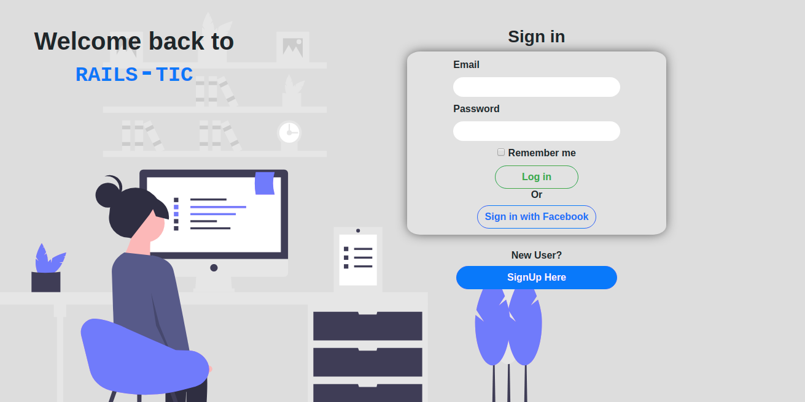

# Project Name

> This repo contains a facebook-like appliction built mainly with ruby in rails.

The application provide the ability to add a post,comment a post,like a post,send and receive friend requests

## Built With

- ruby on rails,
- ruby,
- boostrap

## Live Demo

[Live Demo](https://sleepy-badlands-59290.herokuapp.com)

## Getting Started

**These are the steps to get you up and running with this project on your local cmputer**

To get a local copy up and running follow these simple example steps.

### Prerequisites
  You should make sure you have ruby and rails installed on your local computer
### Setup
  clone this repo by typing 
  `git clone Facebook-clone
  `
  in your terminal
### Install
get the gems used by typing
`
bundle istall
`

create the database by typing
`rais db:create
`
run the migrations by typing
`rails db:migrate
`

### Usage
open your local server by typing
`rails s
`
then login in the app and explore the features

### Run tests
to run the rest type
`rspec
`
in your terminal

## Authors

👤 **Tresor**

- Github: [@githubhandle](https://github.com/githubhandle)
- Twitter: [@twitterhandle](https://twitter.com/twitterhandle)
- Linkedin: [linkedin](https://linkedin.com/linkedinhandle)

👤 **Ahmed**

- Github: [@githubhandle](https://github.com/githubhandle)
- Twitter: [@twitterhandle](https://twitter.com/twitterhandle)
- Linkedin: [linkedin](https://linkedin.com/linkedinhandle)

## 🤝 Contributing

Contributions, issues and feature requests are welcome!

Feel free to check the [issues page](issues/).

## Show your support

Give a ⭐️ if you like this project!

## Acknowledgments

- Hat tip to anyone whose code was used
- Inspiration
- etc

## 📝 License

This project is [MIT](lic.url) licensed.
